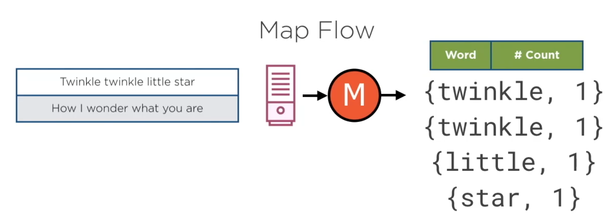

# Hadoop HDFS

## Using with Docker

[https://clubhouse.io/developer-how-to/how-to-set-up-a-hadoop-cluster-in-docker/](https://clubhouse.io/developer-how-to/how-to-set-up-a-hadoop-cluster-in-docker/)

* Docker
* Docker Machine [https://docs.docker.com/machine/overview/](https://docs.docker.com/machine/overview/)
* Clone the repo `git clone https://github.com/big-data-europe/docker-hadoop.git`
* Start `docker-compose up -d`
* Access [http://localhost:9870](http://localhost:9870)

* Accessing bash: `docker exec -it namenode bash`
* Send file to docker container: `docker cp <file> container-name:/<dir>/<file>`

## Local Pseudo-Distributed

* Download Hadoop: [https://www.apache.org/dyn/closer.cgi/hadoop/common/hadoop-2.10.0/hadoop-2.10.0.tar.gz](https://www.apache.org/dyn/closer.cgi/hadoop/common/hadoop-2.10.0/hadoop-2.10.0.tar.gz)

* Get the java installation folder: `/usr/libexec/java_home`

* Edit some configuration files (using vscode): `code etc/hadoop/`
  * **hadoop-env.sh**

    ```bash
    export JAVA_HOME=/Library/Java/JavaVirtualMachines/jdk-14.0.1.jdk/Contents/Home
    export HADDOP_PREFIX=/Users/allanweber/hadoop-2.10.0
    ```

  * **core-site.xml**

      ```xml
      <property>
        <name>fs.defaultFS</name>
        <value>hdfs://localhost:9000</value>
      </property>
      ```

  * **hdfs-site.xml**

    ```xml
    <property>
      <name>fs.replication</name>
      <value>1</value>
    </property>
    ```

  * Create the file **mapred-site.xml**

    ```xml
    <configuration>
        <property>
            <name>mapreduce.framework.name</name>
            <value>yarn</value>
        </property>
    </configuration>
    ```

  * **yarn-site.xml**

    ```xml
    <property>
      <name>yarn.nodemanager.aux-services</name>
      <value>mapreduce_shuffle</value>
    </property>
    ```

* Run the command to format the node: `bin/hdfs namenode -format`
* Start HDFS: `sbin/start-dfs.sh`
* Access the Hadoop Manager: [http://localhost:50070/](http://localhost:50070/)

### Yarn

* Start Yarn: `sbin/start-yarn.sh`
* Resource manager: [http://localhost:8088/](http://localhost:8088/)

### Run a MapReduce sample

```bash
bin/hdfs dfs -mkdir input
...
bin/hdfs dfs -put etc/hadoop/* input/
...
bin/hadoop jar share/hadoop/mapreduce/hadoop-mapreduce-examples-2.10.0.jar grep input output 'dfs[a-z.]+'
```

It will return some job ids:`Job job_1589362481488_0001`, check it at [http://localhost:8088/](http://localhost:8088/)

## Actions in HDFS

* **hdfs dfs -**[command]
* Create a file: `hdfs dfs -touchz /user/root/input/sample.txt`
* Read file: `hdfs dfs -cat <file>`
* Create directory: `-mkdir`
* Copy: `-cp`
* Move: `-mv`

## Permissions

* Change mode: **hdfs dfs -chmod** [num] /directory
* Change mode recursive: **hdfs dfs -chmod -R** [num] /directory
* Change group: **hdfs dfs -chgrp** [group]/directory
* Change owner: **hdfs dfs -chown** [owner] /directory
* Change owner recursive: **hdfs dfs -chown -R** [owner] /directory

## Moving Data

* Send local file to HDFS: `hdfs dfs -put /tmp/<file> <file>`
* Send local file to HDFS and delete the origin: `hdfs dfs -moveFromLocal /tmp/<file> <file>`
* Get HDFS file to local: `hdfs dfs -get <file> /tmp/<file>`

## Maintenance Commands

* Delete complete (empty trash): `hdfs dfs -expunge <file>`

## Map Reduce Sample

### Process Flow





### Java Project Dependencies
